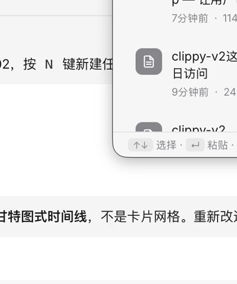
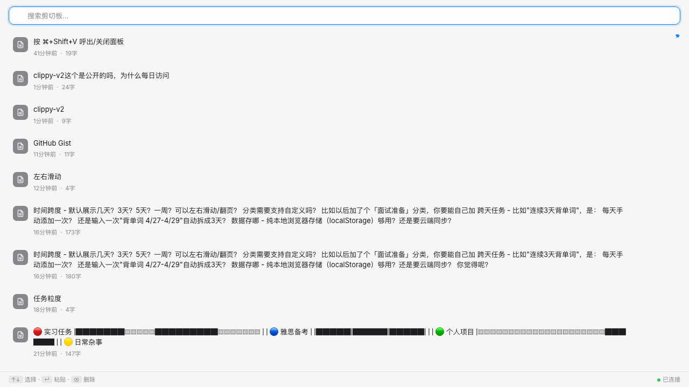

# Clippy v2

macOS 智能剪切板管理器。Go 后端 + Swift 菜单栏 + 液态玻璃 UI。





---

## ✨ 特性

- **自动捕获** — 500ms 轮询系统剪切板，自动去重，支持文本/代码/URL/JSON 识别
- **液态玻璃 UI** — macOS Tahoe 设计语言，SVG 图标，亚克力毛玻璃效果
- **快速操作** — 搜索、固定、删除、一键粘贴，全部键盘可操作
- **分类筛选** — 全部 / 已固定 / 代码 / 链接，实时计数
- **全局快捷键** — `⌘ + Shift + V` 随时呼出
- **隐私保护** — 敏感内容识别，隐私模式暂停记录
- **轻量高效** — 内存 < 50MB，CPU < 1%（静止时）

## 📦 安装

### Homebrew（推荐）

```bash
brew tap j1angyuxuan811-lab/clippy
brew install clippy
open /Applications/Clippy.app
```

### 手动安装

1. 从 [Releases](https://github.com/j1angyuxuan811-lab/clippy-v2/releases) 下载 `Clippy-1.0.0.zip`
2. 解压后将 `Clippy.app` 拖入 `/Applications`
3. 双击打开

### ⚠️ 首次运行

需要授予辅助功能权限：

**系统设置 → 隐私与安全性 → 辅助功能 → 启用 Clippy**

## 🎮 使用

| 操作 | 快捷键 / 方式 |
|------|--------------|
| 呼出/关闭面板 | `⌘ + Shift + V` 或点击菜单栏 📋 |
| 搜索 | 面板顶部输入框 |
| 选择条目 | `↑` `↓` 方向键 |
| 粘贴选中项 | `Enter` |
| 固定/取消固定 | 悬停显示 📌 按钮 |
| 删除 | 悬停显示 ✕ 按钮 |
| 关闭面板 | `Esc` 或点击外部区域 |
| 导出 | 点击顶部导出按钮 → JSON/CSV |
| 隐私模式 | 点击眼睛图标暂停记录 |

## 🏗 架构

```
┌─────────────────────────────────────────────────┐
│                Clippy.app                       │
│  ┌──────────────────────────────────────────┐   │
│  │  Swift (Menu Bar + Panel + Hotkey)       │   │
│  │  ┌────────────────────────────────────┐  │   │
│  │  │  WKWebView (Liquid Glass UI)      │  │   │
│  │  └──────────────┬─────────────────────┘  │   │
│  └─────────────────┼────────────────────────┘   │
│                    │ HTTP API (:5100)            │
│  ┌─────────────────┼────────────────────────┐   │
│  │  Go Backend (Clipboard + SQLite + API)   │   │
│  └──────────────────────────────────────────┘   │
└─────────────────────────────────────────────────┘
```

### 技术栈

| 层 | 技术 | 职责 |
|----|------|------|
| 前端 | WKWebView + HTML/CSS/JS | 液态玻璃 UI，SVG 图标，键盘导航 |
| 壳层 | Swift (AppKit) | 菜单栏、全局热键、进程管理、剪切板写入 |
| 后端 | Go | 剪切板监听、SQLite 存储、REST API |
| 存储 | SQLite | 1000 条记录，自动清理 |

### 为什么 Go + Swift？

- **Go**：高并发轮询（500ms），SQLite 操作快，单二进制部署
- **Swift**：原生菜单栏集成，Carbon API 全局热键，进程生命周期管理
- **通信**：HTTP API 解耦，方便后续扩展（CLI 工具、其他客户端）

## 🔌 API

所有端点运行在 `http://localhost:5100`

| 方法 | 路径 | 说明 |
|------|------|------|
| GET | `/api/clips` | 获取所有剪切板条目 |
| GET | `/api/clips/search?q=` | 搜索 |
| GET | `/api/clips/:id` | 获取单条 |
| PUT | `/api/clips/:id/pin` | 切换固定状态 |
| DELETE | `/api/clips/:id` | 删除条目 |
| DELETE | `/api/clips` | 清空所有 |
| GET | `/api/clips/export?format=json` | 导出 JSON |
| GET | `/api/clips/export?format=csv` | 导出 CSV |
| GET | `/api/health` | 健康检查 |

## 🛠 开发

### 前置条件

- macOS 13+ (Ventura)
- Go 1.21+
- Xcode Command Line Tools

### 构建

```bash
# 克隆
git clone https://github.com/j1angyuxuan811-lab/clippy-v2.git
cd clippy-v2

# 编译 Go 后端
cd go-backend && go build -o ../bin/clippy-backend . && cd ..

# 编译 Swift 前端
cd swift-frontend && swift build -c release && cd ..

# 打包 .app
bash build.sh

# 运行
open build/Clippy.app
```

### 项目结构

```
clippy-v2/
├── go-backend/              # Go 后端
│   ├── main.go              # 入口 + 优雅关闭
│   ├── internal/
│   │   ├── clipboard/       # 剪切板轮询
│   │   ├── db/              # SQLite CRUD
│   │   └── api/             # HTTP 路由
├── swift-frontend/          # Swift 前端
│   ├── Package.swift
│   └── Sources/
│       └── ClippyApp.swift  # 菜单栏 + WebView + 进程管理
├── ui-prototype/            # Web UI
│   └── index.html           # 液态玻璃风格
├── homebrew-tap/            # Homebrew 公式
│   └── Formula/clippy.rb
├── screenshots/             # 截图
└── build.sh                 # 构建脚本
```

## 📋 路线图

- [x] 核心 MVP — 自动捕获、历史列表、搜索、固定、删除
- [x] 液态玻璃 UI — macOS Tahoe 风格
- [x] 全局快捷键 — Carbon API
- [x] Homebrew 安装
- [ ] 图片捕获和缩略图
- [ ] 代码语法高亮
- [ ] 英语学习模式（本地词典、生词本导出 Anki）
- [ ] 跨设备同步（局域网 Socket）
- [ ] Obsidian 集成
- [ ] AI 增强（自然语言查询历史）

## 📄 License

MIT
